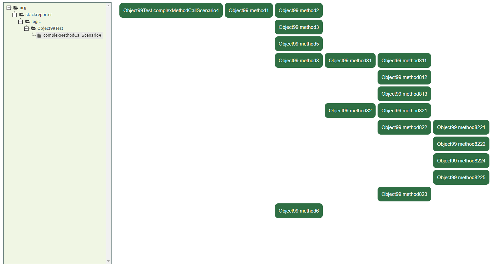

# Stack-Viewer
Stack-Viewer is a tool that renders the `stack-report.js` files generated by [Stack-Reporter](https://github.com/andreiursudev/stack-reporter) as diagrams on a web page.

# How to use
1. Clone this repo.
2. Copy your `stack-report.js` file next to the `index.html` file
3. Open `index.html` in your web browser.
4. Explore your stack.

Example: 

